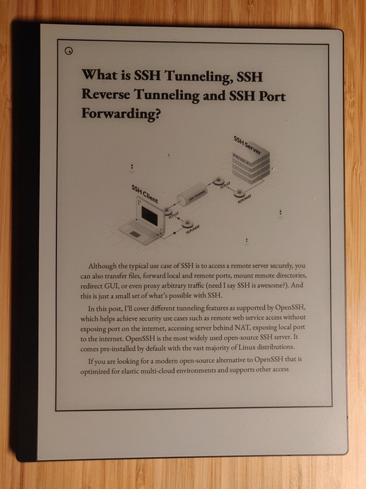

*Remarkable Pocket* synchronizes articles from [Pocket](https://getpocket.com) to
your [Remarkable](https://remarkable.com/) tablet. It can be run on your computer, on a server, or on your Raspberry Pi.
Because it does not
run on the device itself this approach saves battery life, and is resistant to Remarkable software updates.

An example run of the program can be found below:

```
[2021-11-02 14:21:22] Starting sync...
[2021-11-02 14:21:25] Found 1 read article(s) on Remarkable.
[2021-11-02 14:21:25] (1/1) Marking 'Getting Unstuck' as read on Pocket...
[2021-11-02 14:21:25] (1/1) Deleting 'Getting Unstuck' from Remarkable...
[2021-11-02 14:21:27] Found 5 unread article(s) on Remarkable. Downloading 5 more from Pocket.
[2021-11-02 14:21:27] (1/5) Downloading: 'What Modules Are About'.
[2021-11-02 14:21:33] (2/5) Downloading: 'Pursue High-quality Leisure'.
[2021-11-02 14:21:39] (3/5) Downloading: 'Hunting down a C memory leak in a Go program'.
[2021-11-02 14:21:45] (4/5) Downloading: 'Beginner's Guide To Abstraction'.
[2021-11-02 14:22:03] (5/5) Downloading: 'Timer Modules in Microcontrollers'.
[2021-11-02 14:22:03] No content found. Skipping...
[2021-11-02 14:22:15] (6/5) Downloading: 'SSH Tunneling Explained'.
[2021-11-02 14:22:33] Uploading 5 article(s) to Remarkable.
[2021-11-02 14:22:33] (1/5) Uploading: 'What Modules Are About.epub'.
[2021-11-02 14:22:34] (2/5) Uploading: 'Pursue High-quality Leisure.epub'.
[2021-11-02 14:22:34] (3/5) Uploading: 'Hunting down a C memory leak in a Go program.epub'.
[2021-11-02 14:22:34] (4/5) Uploading: 'Beginner's Guide To Abstraction.epub'.
[2021-11-02 14:22:34] (5/5) Uploading: 'SSH Tunneling Explained.epub'.
[2021-11-02 14:22:35] Completed sync in 1m 13s.
[2021-11-02 14:22:35] Next sync in 30m.
```

<details><summary><i>Click here to see what a downloaded article looks like on the Remarkable.</i></summary>

</details>

## Features

- **No installation required.** The application can be run with a single command.
- **Works on Remarkable 1, Remarkable 2, and Remarkable Paper Pro.**
- **Full support for images, code blocks, and formulas.**
- **Articles are downloaded as epubs.** This allows you to customize the font, font size, margins, etc.
- **Automatically archive read articles on Pocket.** When you finish reading an article and close it while on the last
  page, it will be automatically deleted from the Remarkable and archived on Pocket. A new unread article will be
  downloaded in its place.
- **Download articles from Pocket with a given tag.** If a `tag-filter` (see [Configuration](#configuration)) is
  supplied then only articles with that tag will be downloaded.

## Usage

The easiest way to run the application is using Docker. First install Docker for your platform
from https://docs.docker.com/get-docker/. Then run the following command to start the application on Linux or Mac (I
have not tested it on Windows yet):

```
touch ~/.remarkable-pocket ~/.rmapi && mkdir -p ~/.rmapi-cache && docker run -it --env TZ=Europe/Amsterdam -p 65112:65112 -v ~/.remarkable-pocket:/root/.remarkable-pocket -v ~/.rmapi:/root/.rmapi -v ~/.rmapi-cache:/root/.cache/rmapi ghcr.io/nov1n/remarkable-pocket:0.5.0
```

The first time you run the application, you will be asked to authorize Pocket and Remarkable Cloud. Once you have done
this subsequent runs will read the credentials from the `~/.remarkable-pocket` and `~/.rmapi` files. You can also change
the timezone in the command to match your location.

By default, articles are synchronized to the `/Pocket/` directory on the Remarkable every 60 minutes.

### Docker Compose

If you prefer to use [Docker Compose](https://docs.docker.com/compose/) first run the command in the [Usage](#usage)
section and complete the authentication steps (this only needs to happen once). When syncing starts you can stop the
container, download the [docker-compose.yml](docker-compose.yml) file, and run `docker compose up`.

### Raspberry Pi

There is also a Docker image available for the Raspberry Pi, so the command in [Usage](#usage) will work. If you are
running the pi in headless mode (without a screen), you have two options to complete the authentication flow. The
easiest way is to use a VNC client to connect to the pi when running the program for the first time.

Alternatively, you can create an ssh tunnel from your machine to the pi like so:

```bash
ssh -L 65112:localhost:65112 <rpi username>@<rpi ip address>
```

Then, you can proceed with the initial run Docker command and simply copy the authentication URL from the terminal to
your browser. The redirect will be tunneled to the Raspberry Pi via the SSH tunnel.

### Launchd on MacOS

To launch the program on startup and keep it running in the background you can use *launchd* (on Mac)
or *systemd* (on Linux). On Mac right
click [here](https://raw.githubusercontent.com/nov1n/RemarkablePocket/main/nl.carosi.remarkable-pocket.plist) and
click "Save Link As...". Then move the downloaded file to `~/Library/LaunchAgents/`. Finally
run `launchctl load -w ~/Library/LaunchAgents/nl.carosi.remarkable-pocket.plist` in a terminal. Logs will be sent
to `~/.remarkable-pocket.log`.

## Configuration

The default configuration can be changed by providing command-line arguments. Simply append these to the `docker run`
command. Below is a list of all available options.

```
Usage: remarkable-pocket [-hnorV] [-d=<storageDir>] [-f=<tagFilter>] [-i=<interval>] [-l=<articleLimit>]
Synchronizes articles from Pocket to the Remarkable tablet.
  -f, --tag-filter=<tagFilter>
                            Only download Pocket articles with the this tag.
  -o, --run-once            Run the synchronization once and then exit.
  -n, --no-archive          Don't archive read articles.
  -l, --article-limit=<articleLimit>
                            The maximum number of Pocket articles to be present on the Remarkable.
                              Default: 10
  -i, --interval=<interval> The interval between subsequent synchronizations.
                              Default: 60m
  -d, --storage-dir=<storageDir>
                            The storage directory on the Remarkable in which to store downloaded Pocket articles.
                              Default: /Pocket/
  -v, --verbose             Enable verbose logging.
  -h, --help                Show this help message and exit.
  -V, --version             Print version information and exit.

```

## Frequently Asked Questions (FAQ)

<details>
<summary><b>Something isn't working right, how do I fix it?</b></summary>

The first step is to run the command once with the `-r` flag. This resets all configuration, and resolves common
issues. If that doesn't solve your problem feel free to open an issue. Please run the application with the -v flag
for verbose log output, and attach the logs to the ticket. This helps me help you.

</details>

## Limitations

- Articles behind a paywall cannot be downloaded.
- Articles on websites with DDOS protection or captcha cannot be downloaded.
- Articles that use javascript to load the content cannot be downloaded.

## Build Instructions

The project uses Gradle as a build tool and can be built using the `gradle build` command. This will generate jars
in `build/libs/`. To run the jar, use the `java -jar build/libs/remarkable-pocket-x.x.x.jar` command, replacing `x.x.x`
with the correct version.

### Building docker

To build the docker image run `gradle jib`. This will use a dynamically generated Dockerfile based on the configuration
in the `jib` section of the `build.gradle` file. To run the image, see the command in the [Usage](#usage) section.

### Other package formats

If you would like to package the application in another format e.g. `deb`, `nix` or `AUR`, I'm happy to review a Pull
Request.

## Thanks

- https://epub.press/ for providing a free epub generator API. Consider donating to support this project.
- https://github.com/juruen/rmapi for providing a client for the Remarkable Cloud.

## Support

[](https://www.buymeacoffee.com/nov1n)
if you want to say thanks. :-)

## Disclaimer

The author(s) and contributor(s) are not associated with reMarkable AS, Norway. reMarkable is a registered trademark of
reMarkable AS in some countries. Please see https://remarkable.com for their product.

RemarkablePocket uses rmapi to connect to Remarkable cloud. The newly released sync protocol is not yet tested through
and may contain bugs.
As [recommended](https://github.com/juruen/rmapi#warning-experimental-support-for-the-new-sync-protocol) by rmapi please
make sure you have a backup of your files.
